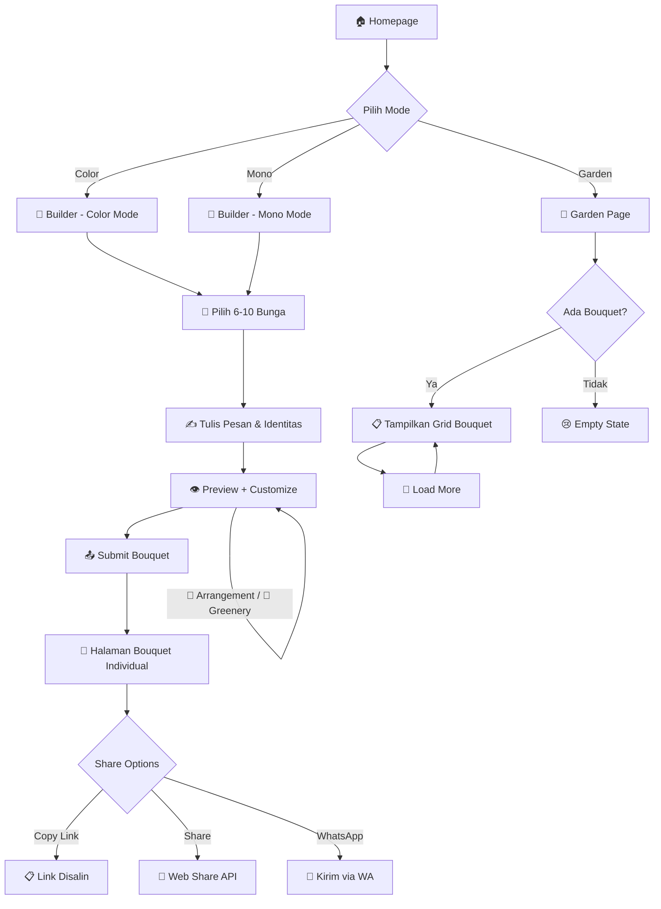
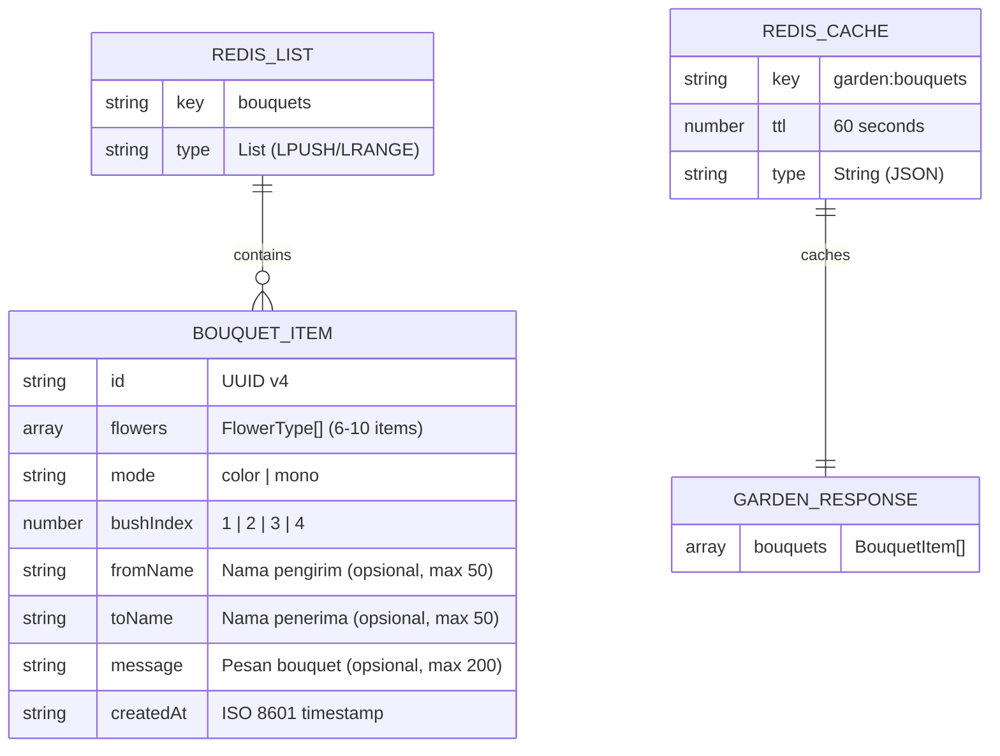

<p align="center">
  
</p>

<h1 align="center">🌸 Digi-Bouquet</h1>

<p align="center">
  <strong>Platform pembuatan bouquet digital — kirim bunga virtual yang cantik ke siapa aja!</strong>
</p>

<p align="center">
  <a href="https://github.com/el-pablos/digi-bouquet/actions/workflows/ci.yml"></a>
  <a href="https://github.com/el-pablos/digi-bouquet/actions/workflows/deploy.yml"></a>
  <a href="https://github.com/el-pablos/digi-bouquet/releases"></a>
  <a href="https://github.com/el-pablos/digi-bouquet/blob/main/LICENSE"></a>
  
  
</p>

---

## 📖 Tentang Proyek Ini

**Digi-Bouquet** adalah web app interaktif buat bikin bouquet bunga digital. User bisa pilih dari 12 jenis bunga, atur komposisinya, preview hasilnya, terus kirim ke "garden" yang bisa dilihat semua orang. Tersedia dalam mode **warna** dan **hitam-putih**.

Live demo: [digibouquet.tams.codes](https://digibouquet.tams.codes/)

## 📸 Screenshot

<p align="center">
  
</p>

---

## ✨ Fitur-Fitur Utama

- 🌷 **12 Jenis Bunga** — Rose, Tulip, Orchid, Dahlia, Peony, Lily, Sunflower, Lavender, Daisy, Chrysanthemum, Iris, Jasmine
- 🎨 **2 Mode Tampilan** — Full Color dan Black & White (Mono)
- 💐 **Bouquet Builder** — Pilih 6-10 bunga, lihat counter real-time, preview langsung
- 🏡 **Garden Page** — Lihat semua bouquet yang udah dibuat orang-orang
- 🌿 **4 Variasi Bush** — Setiap bouquet dapet bush random yang bikin tampilannya unik
- ⚡ **Redis Caching** — Data bouquet di-cache biar loading cepet
- 📱 **Responsive Design** — Tampil cantik di HP, tablet, dan desktop
- 🎭 **Animasi Smooth** — Fade-in, pulse glow, dan transisi yang halus
- 🎵 **Music Player** — Background music YouTube (Kacamata — Afgan) dengan toggle play/pause
- ✍️ **Pesan & Identitas** — Tulis nama pengirim, penerima, dan pesan manis di setiap bouquet
- 🚀 **Auto Deploy** — Push ke `main` langsung deploy otomatis ke Vercel via GitHub Actions
- 🌐 **Custom Domain** — Akses di [digibouquet.tams.codes](https://digibouquet.tams.codes)
- 🔗 **Halaman Bouquet Individual** — Setiap bouquet punya URL unik yang bisa dishare (`/bouquet/{id}`)
- 📋 **Copy Link & Share** — Tombol copy link dan Web Share API untuk berbagi bouquet
- 💚 **WhatsApp Share** — Kirim bouquet ke WhatsApp dengan pesan sweet otomatis
- 🔀 **Customization** — Try New Arrangement (acak posisi bunga) dan Change Greenery di builder
- ♿ **Aksesibel** — Semua elemen punya aria-label dan alt text yang proper

---

## 🏗️ Arsitektur Proyek

Digi-Bouquet dibangun pake **Next.js App Router** dengan arsitektur modern:

- **App Router** — File-based routing dengan layout system
- **Server Components & Client Components** — Hybrid rendering buat performa optimal
- **API Routes** — Backend logic di `/api/*` tanpa perlu server terpisah
- **Redis (ioredis)** — Persistent storage buat bouquet data + caching layer
- **Component Layering** — Bouquet dirender dengan 3 layer: bush background → bunga-bunga → bush top overlay
- **CDN Assets** — Semua gambar bunga dan bush di-host di Cloudflare R2

---

## 📁 Struktur Folder

```
digi-bouquet/
├── app/
│   ├── api/
│   │   ├── bouquet/route.ts     # POST — simpan bouquet baru
│   │   ├── bouquet/[id]/route.ts # GET — ambil satu bouquet by ID
│   │   ├── garden/route.ts      # GET — ambil semua bouquet
│   │   └── health/route.ts      # GET — health check + Redis ping
│   ├── bouquet/page.tsx          # Halaman builder bouquet
│   ├── bouquet/[id]/page.tsx     # Halaman individual bouquet (shareable)
│   ├── garden/page.tsx           # Halaman garden
│   ├── globals.css               # Tailwind + custom styles
│   ├── layout.tsx                # Root layout + metadata
│   └── page.tsx                  # Homepage
├── components/
│   ├── BouquetCard.tsx           # Card preview di garden
│   ├── BouquetMessage.tsx        # Form identitas & pesan bouquet
│   ├── BouquetPreview.tsx        # Preview 3-layer bouquet
│   ├── FlowerGrid.tsx            # Grid pemilihan bunga
│   ├── FlowerItem.tsx            # Item bunga individual
│   ├── GardenGrid.tsx            # Grid bouquet di garden
│   ├── HomeButtons.tsx           # 3 tombol navigasi homepage
│   ├── LoadingSpinner.tsx        # Animasi loading
│   ├── MusicPlayer.tsx           # YouTube music player toggle
│   ├── ShareButtons.tsx          # Copy link, share, WA buttons
│   └── WhatsAppShare.tsx         # Modal kirim bouquet via WhatsApp
├── lib/
│   ├── flowers.ts                # Data bunga + URL generators
│   ├── redis.ts                  # Redis client singleton + helpers
│   ├── utils.ts                  # Utility functions
│   └── whatsapp.ts               # WhatsApp message & URL generator
├── types/
│   └── index.ts                  # TypeScript type definitions
├── __tests__/
│   ├── unit/                     # 12 unit test suites (98 tests)
│   └── e2e/                      # 3 E2E spec files (25 tests)
├── __mocks__/
│   └── uuid.ts                   # UUID mock untuk Jest
├── .github/workflows/
│   ├── ci.yml                    # CI pipeline
│   ├── deploy.yml                # Auto deploy ke Vercel
│   └── release.yml               # Auto release pipeline
├── playwright.config.ts          # Playwright E2E config
├── jest.config.ts                # Jest unit test config
├── next.config.ts                # Next.js config
├── tailwind.config.ts            # (Tailwind v4 — CSS-based)
└── .env.example                  # Template environment variables
```

---

## 🔄 User Flow



---

## 📊 Data Schema (Redis)



---

## 🚀 Cara Install & Run Lokal

### Prerequisites

- Node.js >= 18
- npm >= 9
- Redis instance (bisa pake [Redis Cloud](https://redis.com/try-free/) gratis)

### Langkah-langkah

```bash
# 1. Clone repo
git clone https://github.com/el-pablos/digi-bouquet.git
cd digi-bouquet

# 2. Install dependencies
npm install

# 3. Setup environment variables
cp .env.example .env.local
# Edit .env.local dengan kredensial Redis kamu

# 4. Jalankan dev server
npm run dev

# 5. Buka di browser
# http://localhost:3000
```

### Run Tests

```bash
# Unit tests (Jest)
npm test

# E2E tests (Playwright)
npx playwright install chromium
npx playwright test

# Type check
npm run type-check

# Build
npm run build
```

---

## 🔐 Environment Variables

| Variable | Deskripsi | Contoh |
|----------|-----------|--------|
| `REDIS_HOST` | Hostname Redis server | `redis-xxxxx.cloud.redislabs.com` |
| `REDIS_PORT` | Port Redis server | `11343` |
| `REDIS_PASSWORD` | Password Redis server | `your-redis-password` |
| `NEXT_PUBLIC_SITE_URL` | URL situs production | `https://digibouquet.tams.codes` |

> ⚠️ **Jangan pernah commit file `.env.local`!** File ini sudah ada di `.gitignore`.

---

## 📡 API Documentation

### `GET /api/health`

Health check endpoint + Redis connectivity test.

**Response:**
```json
{
  "status": "ok",
  "redis": "connected",
  "timestamp": "2026-02-15T10:00:00.000Z"
}
```

---

### `POST /api/bouquet`

Simpan bouquet baru ke Redis.

**Request Body:**
```json
{
  "flowers": ["rose", "tulip", "orchid", "dahlia", "peony", "lily"],
  "mode": "color",
  "bushIndex": 2,
  "fromName": "Anisa",
  "toName": "Budi",
  "message": "Selamat ulang tahun! 🎂"
}
```

**Validasi:**
- `flowers`: Array of FlowerType, min 6, max 10 items
- `mode`: `"color"` atau `"mono"`
- `bushIndex`: 1, 2, 3, atau 4
- `fromName`: String opsional, max 50 karakter
- `toName`: String opsional, max 50 karakter
- `message`: String opsional, max 200 karakter

**Response (201):**
```json
{
  "success": true,
  "bouquetId": "a1b2c3d4-..."
}
```

---

### `GET /api/bouquet/[id]`

Ambil satu bouquet berdasarkan ID (dengan per-bouquet caching 5 menit).

**Response (200):**
```json
{
  "success": true,
  "bouquet": {
    "id": "a1b2c3d4-...",
    "flowers": ["rose", "tulip", "orchid", "dahlia", "peony", "lily"],
    "mode": "color",
    "bushIndex": 2,
    "fromName": "Anisa",
    "toName": "Budi",
    "message": "Selamat ulang tahun! \ud83c\udf82",
    "createdAt": "2026-02-15T10:00:00.000Z"
  }
}
```

**Response (404):**
```json
{
  "success": false,
  "error": "Bouquet tidak ditemukan"
}
```
```

---

### `GET /api/garden`

Ambil semua bouquet dari Redis (dengan caching 60 detik).

**Response (200):**
```json
{
  "bouquets": [
    {
      "id": "a1b2c3d4-...",
      "flowers": ["rose", "tulip"],
      "mode": "color",
      "bushIndex": 1,
      "createdAt": "2026-02-15T10:00:00.000Z"
    }
  ]
}
```

---

## 🚢 Deployment ke Vercel

### Auto Deploy (GitHub Actions)

Setiap push ke branch `main` akan otomatis di-deploy ke Vercel via GitHub Actions workflow [deploy.yml](.github/workflows/deploy.yml).

**GitHub Secrets yang dibutuhkan:**
- `VERCEL_TOKEN` — Token dari Vercel dashboard
- `VERCEL_ORG_ID` — Organisation/Account ID Vercel
- `VERCEL_PROJECT_ID` — Project ID Vercel

### Manual Deploy

1. Fork/push repo ke GitHub
2. Buka [vercel.com](https://vercel.com) dan import project
3. Set environment variables di Vercel dashboard:
   - `REDIS_HOST`
   - `REDIS_PORT`
   - `REDIS_PASSWORD`
   - `NEXT_PUBLIC_SITE_URL`
4. Deploy! Vercel otomatis detect Next.js dan build

### Custom Domain

Proyek ini berjalan di custom domain **[digibouquet.tams.codes](https://digibouquet.tams.codes)** via Cloudflare DNS (CNAME → `cname.vercel-dns.com`).

---

## 🛠️ Tech Stack

<p>
  
  
  
  
  
  
  
  
</p>

---

## Credits & Inspirasi

Proyek ini dibuat oleh **Tama** ([@el-pablos](https://github.com/el-pablos)).

Terinspirasi dari karya luar biasa [@pau_wee_](https://x.com/pau_wee_) — creator website [digibouquet.vercel.app](https://digibouquet.vercel.app/) yang menjadi referensi utama proyek ini. Terima kasih atas ide yang cantik dan elegan! 🌸

---

## 👥 Kontributor

<a href="https://github.com/el-pablos">
  
</a>

---

## 📊 Statistik Repo

<p>
  
  
  
  
</p>

---

## 📄 License

MIT License — silakan pake, modif, dan distribusi sesuka hati.

```
MIT License

Copyright (c) 2025 el-pablos

Permission is hereby granted, free of charge, to any person obtaining a copy
of this software and associated documentation files (the "Software"), to deal
in the Software without restriction, including without limitation the rights
to use, copy, modify, merge, publish, distribute, sublicense, and/or sell
copies of the Software, and to permit persons to whom the Software is
furnished to do so, subject to the following conditions:

The above copyright notice and this permission notice shall be included in all
copies or substantial portions of the Software.

THE SOFTWARE IS PROVIDED "AS IS", WITHOUT WARRANTY OF ANY KIND, EXPRESS OR
IMPLIED, INCLUDING BUT NOT LIMITED TO THE WARRANTIES OF MERCHANTABILITY,
FITNESS FOR A PARTICULAR PURPOSE AND NONINFRINGEMENT. IN NO EVENT SHALL THE
AUTHORS OR COPYRIGHT HOLDERS BE LIABLE FOR ANY CLAIM, DAMAGES OR OTHER
LIABILITY, WHETHER IN AN ACTION OF CONTRACT, TORT OR OTHERWISE, ARISING FROM,
OUT OF OR IN CONNECTION WITH THE SOFTWARE OR THE USE OR OTHER DEALINGS IN THE
SOFTWARE.
```

---

<p align="center">
  Made with 💐 by <a href="https://github.com/el-pablos">el-pablos</a>
</p>
